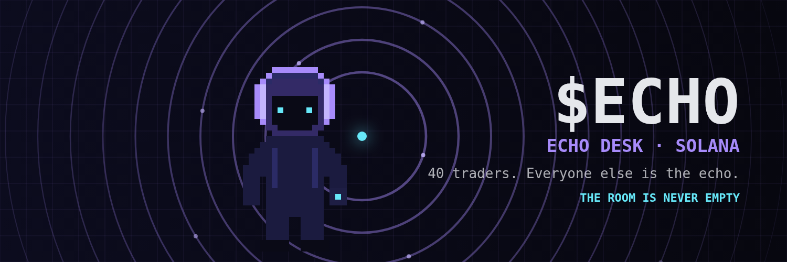
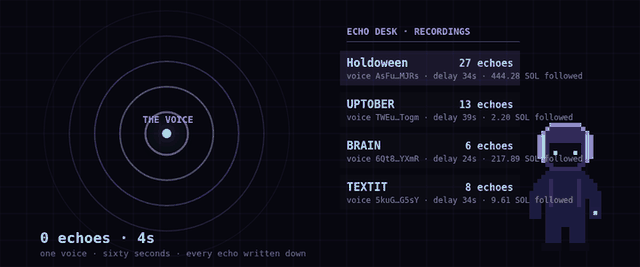
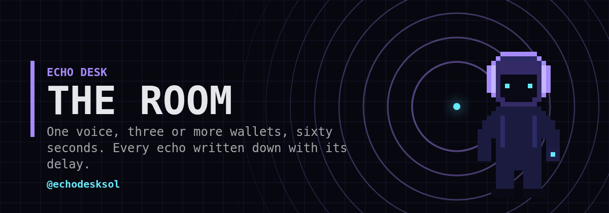
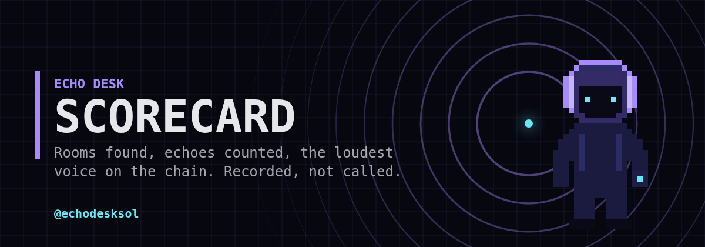
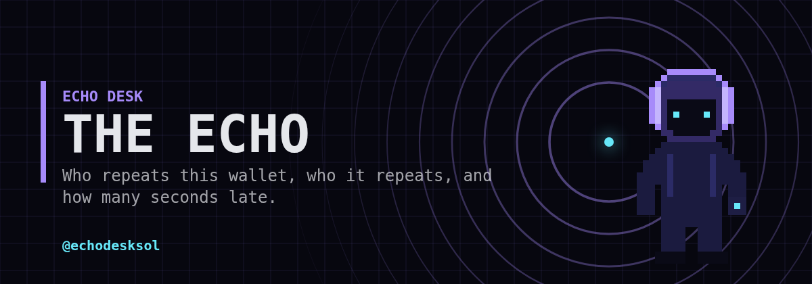
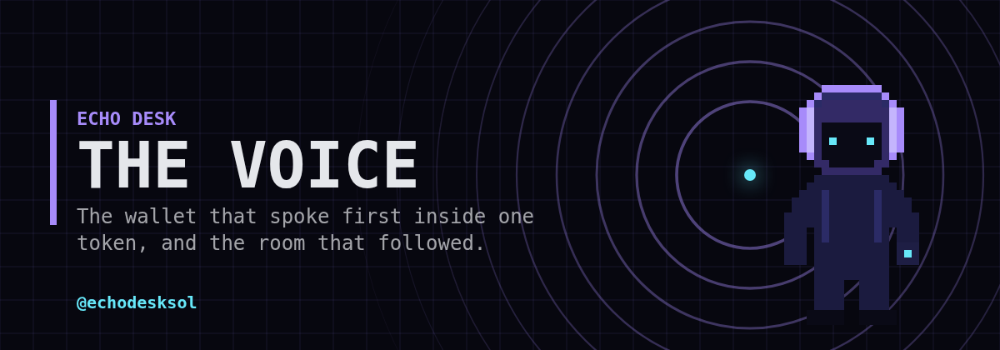

<p align="center">
  
</p>

<h1 align="center">Echo Desk — The Listener</h1>

<p align="center">
  <b>Solana has 40 traders. Everyone else is the echo.</b><br>
  One voice buys first. Three or more wallets repeat it inside sixty seconds. The listener writes down the seconds between them.
</p>

<p align="center">
  <a href="https://t.me/echodesksol_bot"></a>
  <a href="https://x.com/echodesksol"></a>
  
  
</p>

<p align="center">
  
</p>

---

## The room

```
buy at t0 ............................ the voice
buys in (t0, t0 + 60s] ............... the echo
echo >= 3  and  >= 1 SOL followed .... a room, recorded
```

Every 5 minutes the listener pulls trending Solana tokens from DexScreener, reads the last 100 swaps of each through Helius, sorts the buys by time and sweeps them. Each room is stored with the voice, the number of echoes, the first and median delay, and how much SOL followed the voice.

Rooms are never edited or deleted. **No calls. No targets.** Only who spoke, who echoed, and how late.

## Commands

| command | the listener answers |
|:--|:--|
| `/room` | loudest rooms in the last 24h |
| `/top` | scorecard: rooms, echoes, tokens, median delay, loudest voice |
| `/echo <wallet>` | who repeats this wallet inside 60s, and who it repeats. Verdict: **VOICE**, **ECHO** or **QUIET** |
| `/leader <mint>` | the wallet that spoke first inside one token and the room behind it |
| `/help` | the rules of the room |

<p align="center">
   <br>
   
</p>

## The rules of the room

```python
WINDOW_S   = 60    # a buy within 60 s after the voice is an echo
MIN_ECHO   = 3     # a room needs at least 3 echoes
MIN_SOL_IN = 1.0   # and at least 1 SOL following, otherwise it is dust
```

They live at the top of `echo.py`. Change them and the listener changes its ear.

## Run it yourself

```bash
git clone https://github.com/InfraIntelcluster/echo-desk
cd echo-desk
cp .env.example .env      # add HELIUS_KEY and TG_TOKEN
python3 echo.py --test    # offline tests on fixtures
python3 echo.py --scan    # one scan, prints rooms, exits
python3 echo.py           # bot + background listener
```

Python 3.10+, standard library only. No pip.

| var | what |
|:--|:--|
| `HELIUS_KEY` | free key from [helius.dev](https://helius.dev) |
| `TG_TOKEN` | bot token from [@BotFather](https://t.me/BotFather) |
| `TG_CHANNEL` | optional chat id, new rooms get pushed there |

State lives in `state.json`. `board.json` is rewritten after every scan for anything that wants to display the recordings.

## Data sources

- [Helius](https://helius.dev) enhanced transactions — swaps per address
- [DexScreener](https://dexscreener.com) public API — trending tokens, symbols

## What this is not

It does not tell you what to buy. It does not predict. It records who moved first and who followed, and puts the seconds next to it.

<p align="center"><i>The room is never empty.</i></p>
